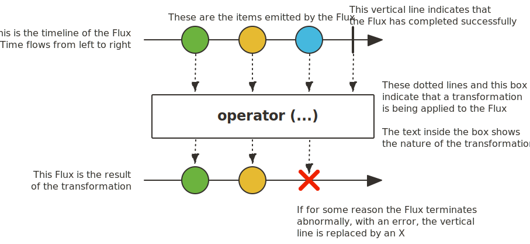

# Reactive Programming 

**Reactive Programming** is a programming paradigm which does async, non-blocking, event driven execution. In Reactive programming we react to data when it arrives, instead of waiting for the response. Reactive programming is extensively used for I/O operations.

- ### 1. Asynchronous 

    Reactive Programming is asynchronous in nature i.e., it doesn't block the thread till it receives response, instead it registers for callbacks or listeners and continue with other works 

- ### 2. Non-Blocking

    The I/O calls are non blocking in nature.

    eg: In a normal DB call the thread is blocked till we get the response back, but in reactive programming the thread  triggers a DB call and do other works and only reacts when there is a response.

- ### 3. Event Driven

    Reactive system only reacts to events (eg : data arrival,server response etc). stream of events flows in and the application threads react to it 

    Even though asynchronous and non-blocking looks kind of the same they are not. Asynchronous makes sure that the main thread is not waiting for the response but there will be other threads that are working in the background. where as non-blocking I/O doesn't block the thread once an I/O call is made the thread works with other requests

    - ### Example 

        In the below code snippet the response is both async and non-blocking when we execute the below code the main thread doesn't wait till response comes it just goes to the next statement i.e., "Request sent!" at the same time its non-blocking as it doesn't block any thread 

        ```java
        Mono<String> response = webClient.get().uri("/data").retrieve().bodyToMono(String.class);

        // The program continues without waiting for response
        System.out.println("Request sent!");
        response.subscribe(); // Result printed later
        ```

## Problem

Assume a Scenario of Shopping Cart Ecosystem where Cart will be showing the last 100 reviews for a product. Reviews will be handled by review service which saves the reviews to DB and fetches the reviews depending on the criteria given can be most useful or latest etc..

If Product Service fetches the reviews from review service every-time someone clicks on the product we are going to make a lot of calls to review service. instead we can handle it by saving the last 100 reviews in the cache with TTL of 24 hrs and only make calls to review service only when there is no data in the cache 

This looks like a pretty neat solution that takes care of latency issue right but think again there are millions of products and when the shopper makes a request to product service for a product for the first time in 24 hrs the product service will make call to review service and the thread (a physical thread) in product service that made the call to review service will wait for the response this action will be blocking the thread once the response is received and the data is processed the thread will be released. if we are processing 1000 such requests in parallel we need to have 1000 physical threads and physical threads are not like application threads that can be spawned. the number of physical threads are limited to the cpu core there are limited no of physical threads per cpu core ranging from 2 to 16 so want to process 1000 unique product requests at a time we need a lot of CPU cores

on top of that this much of computational power is only needed during the peak hrs after that we need a very minimal no of cpu cores 

## solution

- ### Real-Life Analogy

    Imagine you went to a Restaurant and sat at table no : 5. The above solution is like the waiter takes the order and updates the chef to prepare the order and wait at the service counter till the chef completes the order and brings the order back 

    this is highly inefficient instead the waiter can do this 
    - takes the order 
    - updated the chef regarding the order 
    - goes to the next table either to serve the prepared order or take a new order from a different table
    - chef completes the preparation and informs the waiter that table no : 5 order is ready 
    - if waiter is free he will pickup the order immediately or completes the tasks in his queue and then picks the order 

---

Similarly in Reactive Programming when a request comes to product service and when product service needs to make a call to review service the physical thread (waiter) will take the request and update the chef (review service) and the physical thread will cater to other needs once the review service responds with the data the OS notifies thread that the response is ready and if the thread is free it will pick up the response and process it or else it will complete its existing tasks and pick this task 


## How Reactive Programming works?

we will discuss how reactive programming works using the Reactor Library but Before understanding how reactive programming works. we need to understand about netty how it handles requests coming into the system as netty is the core for reactive programming 

- ## Netty

    Netty is a networking framework written in Java that is event driven, non-blocking and asynchronous. It abstracts the network programming like dealing with socket and selector. 
    it internally uses java NIO to run threads without blocking them 

    The key Components of Netty are 

    - ### 1. Channel
        Channel is an abstraction on top of socket, that allows asynchronous I/O read and write. Each channel has Selection key a unique identifier to identify the channel this contains the details like 
        - channel
        - Operations works with (READ,WRITE,ACCEPT,CONNECT)
        - optional Data

    - ### 2. ChannelPipeline
        Channel pipeline is like a sophisticated chain of responsibility implementation. when you get the response from the channel and goes through the channel pipeline which contains the channelHandlers which can process the data 

        ```java


            channel.pipeline()
                .addLast(new LoggingHandler()) // inbound handler
                .addLast(new StringDecoder()) // inbound handler
                .addLast(new BusinessLogicHandler()) // inbound outbound handler
                .addLast(new StringEncoder()); // outbound handler

        ```

    - ### 3. ChannelHandler
        Channel handler are used to process the data the channel handlers are 2 types 

        ---
        - #### 3.1 inbound Handler
        inbound handlers process handle the incoming data events from the socket to the thread
        - #### 3.2 outbound Handler
        outbound handler process handle the outgoing data events from the thread to the socket

        ---
        a handler can be both inbound and outbound in such scenarios both incoming and outgoing data flows through the handler 

        in below code 

        when there is an incoming event the event flows from.  
        Inbound: from socket → pipeline → application

        when there is an outgoing event the event from from application to socket.  
        Outbound: from application → pipeline → socket

        ```java

        channel.pipeline()
            .addLast(new StringDecoder()) // inbound handler
            .addLast(new BusinessLogicHandler()) // inbound outbound handler
            .addLast(new StringEncoder()); // outbound handler

        ```

    - ### 4. EventLoop 
    Event loop is a dedicated thread that does non-blocking I/O operations for one or more channels.
    - ### 5. EventLoopGroup
        EventLoop Group as the name suggests is a group of event loops. There are 2 types event loops group 

        - #### 5.1 Boss Group 
            Boss event group is used to handel incoming connections and register them with the worker groups 
        - #### 5.2 Worker Group
            Worker groups read and write the events from and to the channels 

    - ### 6. Selector
        Selector is java NIO(new I/O) that monitor the sockets and notifies the Event loop about the events 

        The below is snippet is Selector code that monitors the events and notifies the event loop.  

        the code below we are setting the channel as server channels ch1 and ch2 that are non blocking and the server channels are registered with a selector saying that it only works with read and accept type operations which reads the incoming data and accepts new connections.  

        Multiple channels can be registered to one selector so relation ship b/w channel and selector is many to one 

        selector.select() blocks the java NIO until an Accept type operation occurs the 
        selector.select() code internally monitors the events with the help of epoll now when there are events from channels it takes all the events and iterates them depending on the key type it does required operations 

        ```java

            Selector selector = Selector.open();
            SocketChannel ch1 = SocketChannel.open();
            SocketChannel ch2 = SocketChannel.open();
            ch1.configureBlocking(false).register(selector, SelectionKey.OP_READ);
            ch2.configureBlocking(false).register(selector, SelectionKey.OP_ACCEPT);

            while (true) {
                selector.select(); // blocks until an event occurs
                Set<SelectionKey> selectedKeys = selector.selectedKeys(); // there can be multiple channels that send events at the same time 
                for (SelectionKey key : selectedKeys) {
                    if (key.isAcceptable()) {
                        // handle new connection
                    } else if (key.isReadable()) {
                        // handle incoming data
                    }
                }
                selectedKeys.clear();
            }


        ```

    ---

    OS Components that you need to be aware of 

    - ### 1. socket
        Socket is endpoint that sends the receives data 
    - ### 2. epoll
        epoll is the linux system kernel call that monitors the sockets. this might look awfully similar to selector, thats because the selector NIO is implemented using epoll in linux there are similar commands in other Operating Systems that monitor the socket like IOCP in windows 

        in below code snippet we have the selector code and the equivalent epoll code 
        at the end epoll_wait blocks the event loop until one or more channels (file descriptor) are ready

        ```java

        // when selector is created it internally creates an epoll instance 
        Selector selector = Selector.open();
        // above code internally runs 
        epfd = epoll_create();

        // when to call the channel register 
        channel.register(selector, ops)
        //internally it runs 
        epoll_ctl(epfd, EPOLL_CTL_ADD, fd, &event);

        // when the selector is waiting for events 
        selector.select()
        // internally it runs 
        epoll_wait(epfd, events, maxEvents, timeout);


        ```


## Reactive Programming work flow 

Lets take the example of the latest 100 reviews problem here and try to explain the reactive workflow.   

when the product application start a server Socket Channel which will be listening to the connections will be established 

```java
ServerSocketChannel serverChannel = ServerSocketChannel.open();
serverChannel.bind(new InetSocketAddress(8080));
serverChannel.configureBlocking(false);
serverChannel.register(selector, SelectionKey.OP_ACCEPT);

```

in general there will be only one serverSocketChannel per application once the server channel is created when a client tries to request data from server a client channel is established with its own selection key this is done by **Boss event Group** whose sole responsibility is to accept new connections register them to the worker group so the channel can now monitored by the event loop in the worker group that is assigned to it 

```java
SocketChannel clientChannel = serverChannel.accept();
clientChannel.configureBlocking(false);
clientChannel.register(selector, SelectionKey.OP_READ | SelectionKey.OP_WRITE);

```

## Registration flow 

Client Channel when registered the selection key is registered to the event loop and each event loop will have a selector and a selector have a epoll instance so many channels can be registered to one event loop i.e., once selector i.e., once epoll instance 

netty support wide variety of network protocols such as TCP , UDP etc.. in general these client connection are kept alive so they can be reused 

once 1 or more clients makes a request to the product service the request come in through the channel. The epoll instance that is monitoring the socket channels will return the selection key of one or more channels that are registered to it through epoll_wait . which is handled by selector which gives this event to the event loop. up until now since the event loop is not having any events it will be in blocked state once the notification is received that there is event ready to be consumed from channel with selection key s1 the event loop will read the data into the bytebuffer a temporary space to store and handle data. If there are any channel pipeline that is processing the data before actual work it will go through the channel after that the the request is handled to the controller 

Now controller after doing some business logic needs to make a call to redis in a reactive way to request for the data. here is the tricky part we saw event loop is unblocked only where epoll_wait is returning the selection key and epoll_wait returns only when there is a change in the socket or channel now how does the product service makes that change.  
  

this is where the redis react library comes into the picture the redis library will now establish a new channel or reuse the existing channel where it makes the socket  writable.  

epoll_wait blocks until the socket that it is monitoring is ready for an operation, can be Read write Accept etc.. epoll doesn't need data to be present to notify the event loop epoll notifies as long as there is a change in the registered state or when there is data  

now once the channel socket  made writable epoll_wait returns selection key then the event loop writes the request to the socket the data goes to the channel pipeline which transforms the data using outbound channel handlers 

Now we wait for the data, till the socket has response event. Once the response comes back  the socket is made readable, and the event loop is notified by epoll_wait returns. Now the event loop is unblocked which process the data and returns the data which will again needs to be written as response to the socket now the socket is made writable and the data is written to the channel 

## FYI

In general the selectors are registered only with OP_READ as OP_WRITE is expensive. if the OP_wRITE is Registered then the event loop always tries to write to the socket even when there is nothing to write 

So when application have outbound data the it registers the socket with OP_WRITE and once the event is published OP_WRITE is unregistered.  

## Mappings 

In the Restaurants analogy 

| Restaurant Concept | Reactive / Netty Concept | Explanation |
|------------------|-------------------------|------------|
| **Waiter** | **EventLoop** | Takes requests from multiple tables and serves them to the particular table. |
| **Table** | **Channel** | One waiter can handle multiple tables; one EventLoop can manage multiple channels concurrently. |
| **Customer** | **Requester / Client** | Sends the request that needs to be processed. |
| **Dish** | **Request / Response Data** | The payload or data that flows through the system. |
| **Chef** | **Physical Thread / Worker Thread** | Executes the actual CPU-bound work; can cook multiple dishes requested by different waiters. |
| **Cooking Pans** | **Socket** | Only one item can be cooked at a time; similarly, one request flows through a socket at a time. |
| **Ready Bell** | **epoll / Selector Notification** | Notifies the EventLoop that data is ready to read or write. |
| **Host / Receptionist** | **Boss EventLoopGroup** | Accepts incoming requests and assigns them to available EventLoops (waiters). |  

---


# Reactor

- ## Publisher-Subscriber Model

    Lets come to actual usage of the Reactive Programming. For implementation of reactive programming we have different libraries like RXjava or Reactor we will be working with reactor library.Reactor is a library that follows publisher-subscriber model.  
    
    In publisher subscriber model there will be a publisher that publishes the message and  to a central broad cast and the subscriber who registers with the broker, receives the message.


    - ### 1. Publisher 
        Publisher  publishes the event to the broker but in Reactor there is no separate broker the publisher it self acts as broker the publisher it self handles the flow of data. there are 2 type of publishers Flux and mono 

        - ### Flux 
            Flux is the standard publisher that emits 0 or more items  

            

            in the below code snippet the flux takes stream of 3 items.

            ```java
            Flux<String> flux = Flux.just("Apple", "Banana", "Cherry");
            ```

        - ### Mono 
            Mono is the standard publisher that emits 0 or 1 items 

            

            in the below code snippet mono takes stream of 1 item  "Hello Mono"

            ```java
            Mono<String> mono = Mono.just("Hello Mono");
            ```

        Flux and Mono both have 3 types of events (more of method calls ) onNext() , onComplete() , onError() both onComplete and onError are used for used for terminating the stream on success and failure scenarios respectively. where as onNext gives the next element and can be iterated till items in the stream are exhausted. in mono its expected that onNext is immediately followed by onComplete or mono emits a single onError.    
        
        A publisher can Publish event stream in 2 ways Hot publish and cold publish 


        - ### Hot Publish 
            Hot publish emits data independent of subscribers. Subscribers may miss events if they don't subscribe from the beginning 

            its more like streaming live match you will see from when you started from watching but not form start 

            ```java

            Flux<Long> hotFlux = Flux.interval(Duration.ofMillis(500)) // emits every 500ms
                                  .publish()  // converts to ConnectableFlux (hot)
                                  .autoConnect(); // starts emitting immediately

            ```

        - ### Cold Publish 
            Cold publish start emitting data only after the subscribe() initiates the pipeline 

            its more like watching a movie you can start watching from the start 

            ```java

            Flux<Integer> coldFlux = Flux.range(1, 5); // cold publisher

            System.out.println("Subscriber 1 subscribes:");
            coldFlux.subscribe(i -> System.out.println("Subscriber 1 received: " + i));

            ```

    - ### 2. Subscriber
        Subscriber is the one who registers for receiving messages . reactor has only one type of subscriber .subscribe(). for cold publishing .subscribe() triggers the data flow. There are 5 variants of subscribe() method

        ```java
        
        // Just Subscription and trigger and gives the response 
        subscribe();
        
        // do something with each item 
        subscribe(Consumer<? super T> consumer);
        
        // deals with values and react to error 
        subscribe(Consumer<? super T> consumer,
          Consumer<? super Throwable> errorConsumer);
          
        // deals with values and error and runs some code 
        subscribe(Consumer<? super T> consumer,
          Consumer<? super Throwable> errorConsumer,
          Runnable completeConsumer);
        
        // Deal with values and errors and successful completion but also do something with the Subscription produced by this subscribe call.
        subscribe(Consumer<? super T> consumer,
          Consumer<? super Throwable> errorConsumer,
          Runnable completeConsumer,
          Consumer<? super Subscription> subscriptionConsumer);

        ```

- ## BackPressure 
    Backpressure is a mechanism where the subscriber can control the rate at which the data comes from publisher 
    - publisher publishes the data 
    - The Subscriber tells how many items it can consume at at time 
    - produce will only emit that many items 

    By Default flux support backpressure via request(n) 

    ```java

    Flux<Integer> flux = Flux.range(1, 10);

    flux.subscribe(new Subscriber<Integer>() {
            private Subscription subscription;
            private int count = 0;

            @Override
            public void onSubscribe(Subscription s) {
                this.subscription = s;
                subscription.request(2); // Ask for 2 items at a time
            }

            @Override
            public void onNext(Integer item) {
                System.out.println("Received: " + item);
                count++;
                if (count % 2 == 0) {
                    subscription.request(2); // Request next 2 items
                }
            }

            @Override
            public void onError(Throwable t) {
                System.err.println("Error: " + t);
            }

            @Override
            public void onComplete() {
                System.out.println("Completed!");
            }
        });


    ```

    there are other alternatives like

    | Operator                  | Data Loss          | Memory Safe                 | Keeps Latest | Buffers             | Slows Source | Best Use Case                                      |
    |---------------------------|--------------------|-----------------------------|---------------|---------------------|---------------|----------------------------------------------------|
    | `onBackpressureBuffer(n)` | ❌ No (unless full) | ❌ No (can OOM if unbounded) | ❌ No         | ✅ Yes (up to limit) | ❌ No         | Must retain all data (e.g., logs, file writes)     |
    | `onBackpressureDrop()`    | ✅ Yes              | ✅ Yes                       | ❌ No         | ❌ No                | ❌ No         | High-frequency non-critical data (e.g., telemetry) |
    | `onBackpressureLatest()`  | ✅ Yes              | ✅ Yes                       | ✅ Yes        | ❌ No                | ❌ No         | Real-time updates (e.g., UI sliders, live prices)  |
    | `limitRate(n)`            | ❌ No               | ✅ Yes                       | ✅ (indirect) | ❌ No                | ✅ Yes        | Throttling data sources (e.g., APIs, DB streams)   |

    limitRate is best suited if the source like the Mongo reactive library which honour the backpressure if the source it self doesn't honour backpressure like http requests or message events its only the stream that will be honouring the backpressure in  which case there will be issue for data loss in such cases depending on the scenario its better to pick b/w the remaining operators 

    
    In such cases, depending on the use case, it's better to use:
    - `onBackpressureBuffer()` if **data must be retained**,
    - `onBackpressureDrop()` if **data can be skipped** during load,
    - `onBackpressureLatest()` if only the **latest data matters**.


- ## Thread Pooling  


